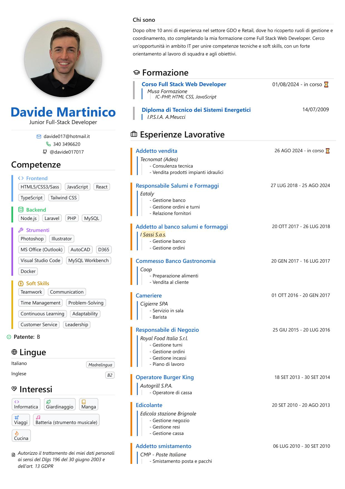

# 👨‍💻 Davide Martinico

Full-Stack Developer in formazione, appassionato di web e tecnologie moderne.  
🔗 [Portfolio](https://davide-martinico-portfolio.netlify.app/) • [CV ↓](#-curriculum-vitae)

---

## 📄 Curriculum Vitae

Visualizza e scarica il mio CV in due versioni: tema chiaro e tema scuro.

<table>
  <tr>
    <td align="center">
      <strong>🌙 Modalità Scura</strong> 
       
      <a href="./cv-dark.pdf">📄 Scarica PDF</a>
    </td>
    <td align="center">
      <strong>☀️ Modalità Chiara</strong> 
       
      <a href="./cv-light.pdf">📄 Scarica PDF</a>
    </td>
  </tr>
</table>
